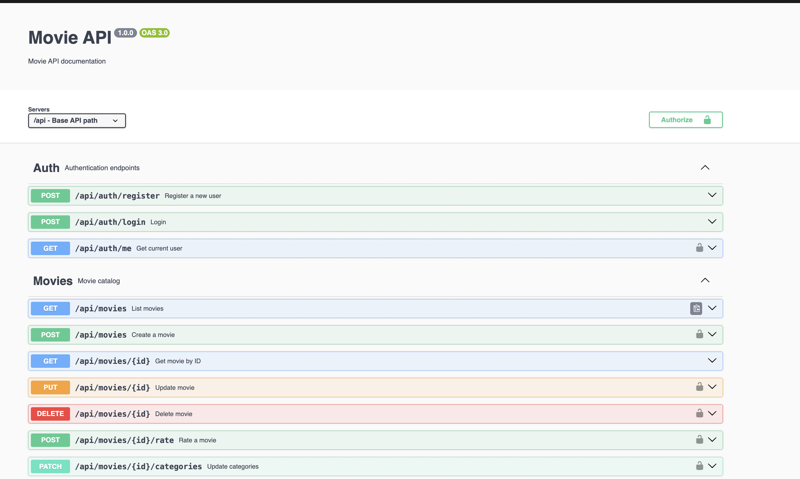
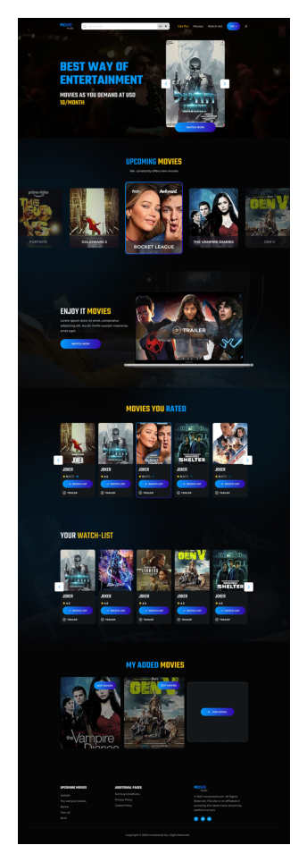

## Movie World

A TypeScript/Express/Mongoose backend for movies with filtering, CRUD, auth, Swagger docs, and tests.

- Front-end: Use React.js, Redux, TypeScript, Tailwind
- Back-end:  Express.js, JWT, Typescript
- Database:  MongoDB

#### Project Demo :point_down:

[](https://youtu.be/0v_kSnmTJzs?si=GgUmjX8WZ0N3RIaJ)

## Quick Start

**🔲 Run backend**

```bash
#after clone the project
cd backend
cp .env.example .env  # ensure MONGO_URI is set
npm install
npm run seed
npm run dev
```
**🔲 Run fronted**

```bash

cd frontend
npm install

npm run dev
```

- API: `http://localhost:4000/`
- Swagger: `http://localhost:4000/api/docs`

## Backend Project Structure

```
src/
  config/        # db, swagger
  controllers/   # route handlers (wrapped with asyncHandler)
  middleware/    # auth & global error handler
  models/        # Mongoose models
  routes/        # Express routes
  seed/          # seeding scripts
  utils/         # shared utilities (errors, asyncHandler)
  __tests__/     # Jest + Supertest tests


```

## Fronted Project Structure

```bash

frontend/
├─ .gitignore
├─ index.html
├─ package.json
├─ package-lock.json
├─ postcss.config.js
├─ tailwind.config.js
├─ tsconfig.json
├─ vite.config.ts
├─ public/
│  ├─ details.png
│  ├─ images.jpeg
│  └─ landing.png
└─ src/
   ├─ main.tsx
   ├─ App.tsx
   ├─ styles.css
   ├─ api/
   │  └─ axios.ts                # Axios instance + auth header interceptor + list picker helper
   ├─ components/
   │  ├─ AddSection.tsx
   │  ├─ HeroBillboardExact.tsx
   │  ├─ HeroTrailer.tsx
   │  ├─ MovieCard.tsx
   │  ├─ Section.tsx
   │  ├─ SpotlightSection.tsx
   │  └─ shared/
   │     ├─ Footer.tsx
   │     └─ Navbar.tsx
   ├─ context/
   │  └─ AppContext.tsx          # App-level context provider
   ├─ features/
   │  └─ auth/
   │     └─ authSlice.ts         # login/register thunks, token persistence, logout reducer
   ├─ pages/
   │  ├─ EditMovie.tsx           # (route currently commented out in App.tsx)
   │  ├─ Home.tsx
   │  ├─ Login.tsx
   │  ├─ MovieDetails.tsx
   │  ├─ Register.tsx
   │  └─ Watchlist.tsx
   ├─ redux/
   │  └─ store.ts                # Redux store configuration
   ├─ types/
   │  └─ index.ts
   ├─ utils/
   │  └─ hooks.ts
   └─ __tests__/
      ├─ listAdapter.test.ts
      └─ section.fetch.test.tsx


```


OUTPUT:

 
 
 

